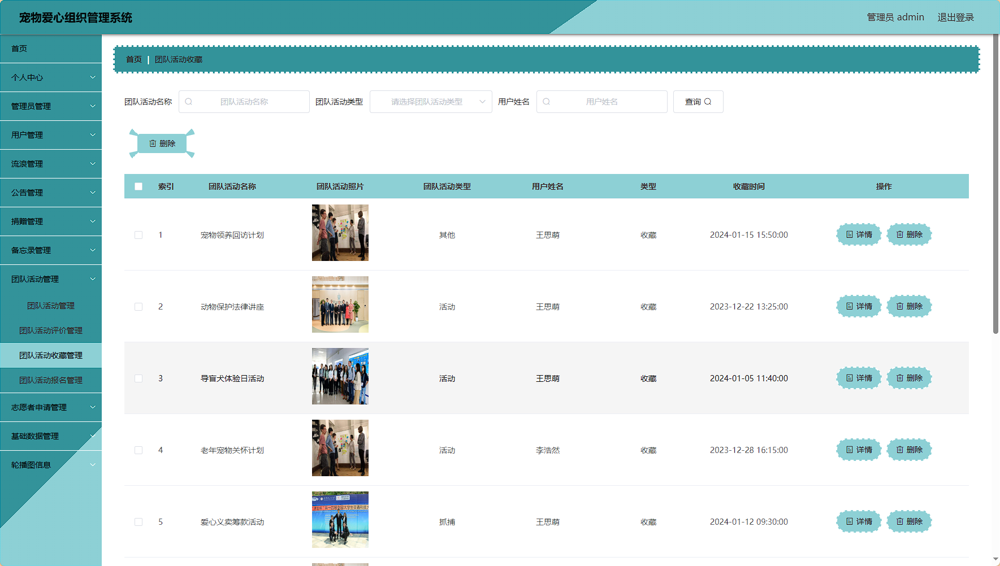

# 基于SpringBoot的宠物爱心组织管理系统 / Pet_Love_Organization_Management


> 更多毕设项目可跳转至项目导航栏检索：[毕设项目](http://sysadmin.3vfree.vip)，需要联系博主v：xq-lucky311，q：1047944234. 备注：项目咨询注：由于前端项目太大，仅上传了后端代码，未包含前端代码...

## 项目简介  
基于SpringBoot + MyBatis Plus + Vue.js的宠物爱心组织管理系统，包含管理员和用户双角色操作体系。系统采用MySQL数据库存储数据，实现宠物管理、流浪动物救助、志愿者申请、团队活动管理、捐赠管理等核心功能，为宠物爱心组织提供全流程数字化解决方案。

## 特征介绍  
- **双角色体系**：管理员可管理21个核心模块，用户端支持宠物领养/评价、活动报名、捐赠等操作。  
- **RBAC权限控制**：集成Shiro实现动态权限管理，通过自定义注解(@LoginUser, @IgnoreAuth)控制接口访问。  
- **MyBatis Plus增强**：零SQL实现单表CRUD，配置多租户字段自动填充(MyMetaObjectHandler)。  
- **模块化架构**：清晰分层设计(controller/service/dao/entity)，支持业务模型与视图对象分离。  
- **工具集成**：集成Hutool工具包、Apache POI(Excel处理)、百度AI SDK(图像识别)等实用组件。  
- **文件管理**：独立文件控制器(FileController)实现上传/下载，静态资源隔离存储。  

## 代码结构
```
src/
├── main/
│ ├── java/
│ │ ├── com/
│ │ │ ├── annotation/ # 鉴权注解(LoginUser, IgnoreAuth)
│ │ │ ├── config/ # 全局配置(MybatisPlusConfig, 拦截器配置)
│ │ │ ├── controller/ # 接口层(21个功能控制器)
│ │ │ ├── dao/ # 数据访问层(MyBatis接口)
│ │ │ ├── entity/ # 数据模型
│ │ │ │ ├── model/ # 业务模型对象
│ │ │ │ ├── view/ # 视图对象
│ │ │ │ ├── vo/ # 值对象
│ │ │ ├── interceptor/ # 权限拦截器(AuthorizationInterceptor)
│ │ │ ├── service/ # 服务层接口
│ │ │ │ ├── impl/ # 服务实现类
│ │ │ ├── utils/ # 工具类(日期/文件/HTTP/百度AI)
│ │ │ ├── chongwuaixinzuzhiguanliApplication.java # 启动类
│ ├── resources/
│ │ ├── mapper/ # MyBatis映射文件(XML)
│ │ ├── application.yml # 主配置文件
│ │ ├── static/ # 静态资源
│ │ │ ├── upload/ # 文件上传目录
│ │ ├── admin/ # 后台管理页面
│ │ ├── front/ # 前端用户页面
```


## 使用说明
1. **访问地址**  
   - 前台：http://localhost:8080/chongwuaixinzuzhiguanli/front/index.html  
   - 后台：http://localhost:8080/chongwuaixinzuzhiguanli/admin/dist/index.html  

2. **测试账户**  
   - 管理员：admin/admin  
   - 用户：a1/123456 | a2/123456 | a3/123456  

3. **数据库配置**  
   修改 `src/main/resources/application.yml`：  
   ```yaml
   url: jdbc:mysql://127.0.0.1:3306/chongwuaixinzuzhiguanli?useUnicode=true&...
   username: root
   password: 123456

4. ​​注意事项​​
   - 使用谷歌浏览器访问
   - 图片上传路径：src/main/webapp/upload (文件名禁用中文)
   - 实体类分层：Model(业务模型) / View(视图对象) / VO(接口传输对象)
```

# 项目实际截图：
## 登录：


## 前台：


## 后台：





> 等等...

# 精选项目导航 & 快速部署工具
## 项目资源一站直达
- ​**访问项目导航站**：[点击进入](http://sysadmin.3vfree.vip)**快速检索所需项目名称**
- ​**技术栈全覆盖**：Java/SSm/Spring Boot/小程序等主流技术方案
- ​**配套资源**：每个项目均提供部署文档 + 演示视频（附效果截图）

### ▌导航站预览


### ▌工具界面预览


## 捐赠
> 博主将持续更新Java全栈开发项目，包含ssm，springboot，前后端分离系统等项目。
> 此外如果您够宽裕，请博主喝杯咖啡吧！捐赠将用于服务器维护与开源社区建设，感谢您的认可！
> 如需更多Java相关项目毕设3000+，有其他项目需求，sql文件等可联系博主v:xq-lucky311

---